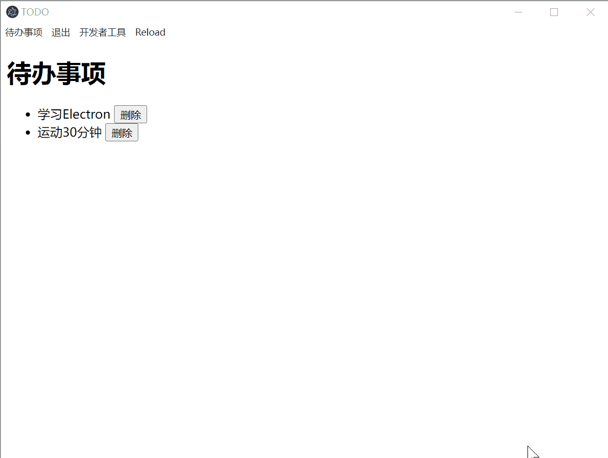

# todos

## 预期效果


## 实现功能
- 点击菜单栏[待办事项-新增]，新建一个窗口[新增]，用于添加事项
- [新增]窗口点击确定后，主窗口出现新增事项
- 点击[删除]按钮，删除对应事项

## 实现代码

1. 创建package.json文件
```bash
npm init
```
entry file设置为app.js
2. 在`package.json`中添加启动项目命令`
```json
"scripts": {
    "start":"electron .",
    "test": "echo \"Error: no test specified\" && exit 1"
},
```
3. 安装项目需要package
```bash
npm install electron -D
```
4. 新建项目目录如下
|-- addItem  # 新增事项窗口
    |-- addItem.html
    |-- addItemRender.html
|-- main # 主窗口
    |-- main.html
    |-- mainRenderer.js
|-- app.js #处理整个应用程序逻辑
|-- preload.js # 通信
|-- package.json
5. 编写代码
(1)main.html
```html
<!DOCTYPE html>
<html lang="en">
<head>
    <meta charset="UTF-8">
    <meta name="viewport" content="width=device-width, initial-scale=1.0">
    <title>TODO </title>
</head>
<body>
    <h1>待办事项</h1>
    <ul>
        <li>学习Electron  <button>删除</button></li>
        <li>运动30分钟  <button>删除</button></li>
    </ul>
    <script src="mainRenderer.js"></script>
</body>
</html>
```
(2)mainRenderer.js
```js
const ul = document.querySelector("ul");

// 新增事项
itemAPI.onNewItem(item=>{
    console.log("onNewItem", item);
    const li = document.createElement("li");
    li.innerText = `${item}  `
    const button = document.createElement("button");
    button.innerText = "删除";
    li.appendChild(button);
    ul.appendChild(li);
})

// 删除事项
ul.addEventListener("click",(event)=>{
    const target = event.target;
    if(target.nodeName === "BUTTON"){
        const parentNode = target.parentNode;
        ul.removeChild(parentNode);
    }
})
```

(3)addItem.html
```html
<!DOCTYPE html>
<html lang="en">
<head>
    <meta charset="UTF-8">
    <meta name="viewport" content="width=device-width, initial-scale=1.0">
    <title>新增</title>
</head>
<body>
    <form >
        <label>待办事项：</label>
        <input autofocus>
        <button>添加</button>
    </form>
   <script src="./addItemRenderer.js"></script>
</body>
</html>
```
(4)addItemRenderer.js
```js
document.querySelector("button").addEventListener("click", ()=>{
    const item = document.querySelector("input");
    itemAPI.addItem(item.value);
})
```
(5)preload.js
```js
const {contextBridge, ipcRenderer} = require("electron")

contextBridge.exposeInMainWorld("itemAPI", {
    "addItem": (item) => ipcRenderer.invoke("item:add",item),
    "onNewItem": (callback) => ipcRenderer.on("item:add", (_,value)=>callback(value))
})
```
(6)app.js
```js
const {app, BrowserWindow,Menu, ipcMain} = require("electron");
const path = require("node:path");

let mainWindow;
let addWindow;

app.on("ready",()=>{
    mainWindow = new BrowserWindow({
        title:"TODO",
        webPreferences:{
            preload:path.join(__dirname,"preload.js")
        }
    });
    mainWindow.loadFile("main/main.html");
    const mainMenu = Menu.buildFromTemplate(menuTemplate);
    Menu.setApplicationMenu(mainMenu)
})

ipcMain.handle("item:add",(_,item)=>{
    mainWindow.webContents.send("item:add",item);
})


function createAddItemWindow(){
    addWindow = new BrowserWindow({
        width:350,
        height:200,
        title:"添加事项",
        webPreferences:{
            preload:path.join(__dirname,"preload.js")
        }
    });
    addWindow.removeMenu();
    addWindow.loadFile("addItem/addItem.html");
    addWindow.on("closed",()=>{
        addWindow = null;
    })
}


let menuTemplate = [
    {
        label:"待办事项",
        submenu:[
            {
                label:"新增",
                click: function () {
                    createAddItemWindow();
                }
            }
        ]
    },
    {
        label:"退出",
        accelerator:process.platform === "darwin"? "Command+Q":"Ctrl+Q",
        click:function(){
            app.quit();
        }
    },
    
];

if(process.platform === "darwin"){
    menuTemplate.unshift({});
}

if(process.env.NODE_ENV !== "production"){
    menuTemplate.push(
        {
            label:"开发者工具",
            click:function(item, focusedWindow){
                focusedWindow.toggleDevTools();
            }
        },
        {
            role:"reload"
        }
    )
}
```


## 项目代码参考
[todos](https://github.com/jingping-ye/learn-electron/tree/todos)

