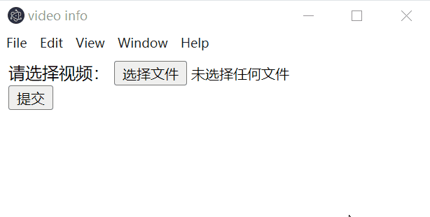

# Electron入门项目1：显示上传视频时长

## 要求
选择上传视频后显示视频的时长（以秒为单位）。参考如下:


## 实现
一、搭建开发环境

1.在空白文件夹下执行npm init命令，生成package.json文件
```bash
npm init
```
- 注意：entry file输入main.js

2.安装开发时要用到的工具包
```bash
# 安装electron
# 主框架
npm install electron - D

# 安装electron-forge
# 用于构建和打包
npm install @electron-forge/cli -D
# 此处是electron-forge 7.3.0的一个bug，我们需要额外安装该package
npm install @electron-forge/plugin-fuses -D
npx electron-forge import

# 安装fluent-ffmpeg
# Node.js使用fluent-ffmpeg来调用ffmpeg软件来获取视频的相关信息
npm install fluent-ffmpeg -S
```
3.安装ffmpeg软件，用于支持获取视频信息
（1）点击下载[ffmpeg](https://github.com/BtbN/FFmpeg-Builds/releases/download/latest/ffmpeg-master-latest-win64-gpl.zip)
（2）下载之后解压，点击解压后的bin文件夹，复制文件路径，比如我的路径为
```bash
D:\software\download\ffmpeg-master-latest-win64-gpl\bin
```
(3)将上面的路径添加到系统变量的Path项中
操作路径如下：
此电脑 > 属性 > 高级系统设置 > 环境变量 > 系统变量[Path]> 编辑


4.新建若干文件，实现如下项目结构
```js
|-- index.html
|-- renderer.js
|-- preload.js
|-- main.js
|-- package.json
|-- ...
```
- index.html+renderer.js 负责renderer process，该进程负责前端的界面渲染
- main.js 负责 browser process，也称为main process，该进程负责管理app底层逻辑运行
- 因为renderer process和main process是两个独立的进程，双方无法直接通信。preload.js在此处则承担两个进程之间通信的桥梁。类似于第三方传话的形式，实现render process和main process的间接通信。

二、技术要点
1. 读取视频信息技术
使用 ffmepg+fluent-ffmpeg

2. 进程间通信
参考[Inter-Process Communication](https://www.electronjs.org/docs/latest/tutorial/ipc)

进程之间不能直接通信，要通信必须借助preload.js这一桥梁。这是一个很重要的前提。
（1）从renderer process向main process发送信息
发送API: `"customName":(data)=>ipcRender.invoke(eventName, data)`
接收API: `ipcMain.handle(eventName, (event, data)=>{ // do something})`

假设我们要从renderer process向main process发送一条信息，比如{message:"Important Message!"}。那么首先，先在preload.js中注册我们要通信的事件。比如如下代码，注册一个actionAPI.sendMessage事件，当我们调用该事件时，会触发一个"message:send"事件。
actionAPI.sendMessage供renderer process使用。
"message:send"用于main process监听。
```js
// preload.js
const {ipcRender, contextBridge} = require("electron");
contextBridge.exposeInMainWorld("actionAPI",{
    "sendMessage": (message)=>ipcRenderer.invoke("message:send", message)
})
```
在main process中，我们要对事件进行监听以接受到该信息。
```js
const {ipcMain} = require("electron");
ipcMain.handle("messsage:send",(event, message)=>{
    // do something here
    console.log("message",message);
})
```

(2)从main process向renderer process 发送消息
发送API: `win.webContents.send(eventName, data)`
接收端API: `"onCustomName":(callback) =>ipcRenderer.on("eventName", (_, value) => callback(value))`
在前端调用 `xx.onCustomeName((value)=>{ // do something....})`


三、实现功能(参考代码如下)
1. index.html
```html
<!DOCTYPE html>
<html lang="en">
<head>
    <meta charset="UTF-8">
    <meta name="viewport" content="width=device-width, initial-scale=1.0">
    <title>video info</title>
</head>
<body>
    <form>
        <label>请选择视频：</label>
        <input type="file" accept="video/*">
        <button type="submit">提交</button>
    </form>
    <div id="info">
    </div>
    <script src="./renderer.js"></script>
</body>
</html>
```
2. preload.js
```js
const {contextBridge,ipcRenderer} = require('electron');

contextBridge.exposeInMainWorld("videoAPI",{
    "videoPath": (path)=>{return ipcRenderer.invoke("video:path", path)},
    "onVideoDuration":(callback) =>ipcRenderer.on("video:duration", (_, value) => callback(value))
});
```

3.renderer.js
```js
const submitBtn =  document.querySelector("button");
submitBtn.addEventListener('click',(event)=>{
    event.preventDefault();
    const {path} = document.querySelector("input").files[0];
    videoAPI.videoPath(path);
})

videoAPI.onVideoDuration((duration)=>{
    document.getElementById("info").innerHTML=`这个视频时长为 ${duration} 秒。`
})
```

4.main.js
```js
const {app, BrowserWindow, ipcMain} = require('electron');
const ffmpeg = require('fluent-ffmpeg');
const path = require("node:path")

let win;
function createWindow() {
    win = new BrowserWindow({
        webPreferences:{
            preload:path.join(__dirname, "preload.js")
        }
    })
    win.loadFile('index.html')
}

app.on('ready',()=>{
    console.log('The app is ready!');
    createWindow();
})

ipcMain.handle("video:path",(_, path)=>{
    console.log("path",path)
    ffmpeg.ffprobe(path, function(_, metadata) {
        win.webContents.send("video:duration", metadata.format.duration);
    });
})
```
